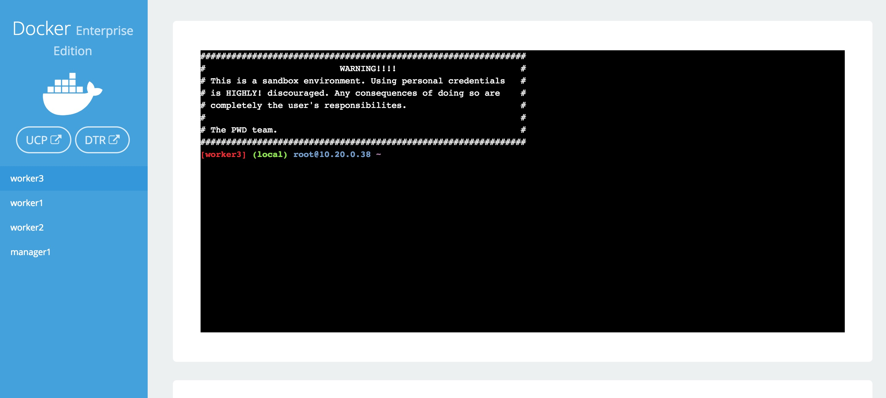
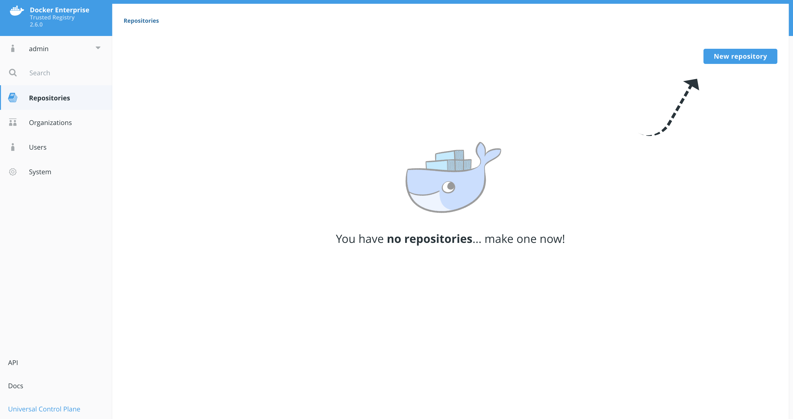
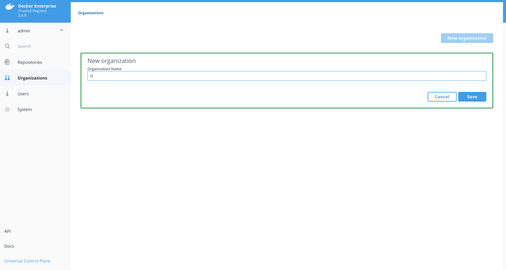
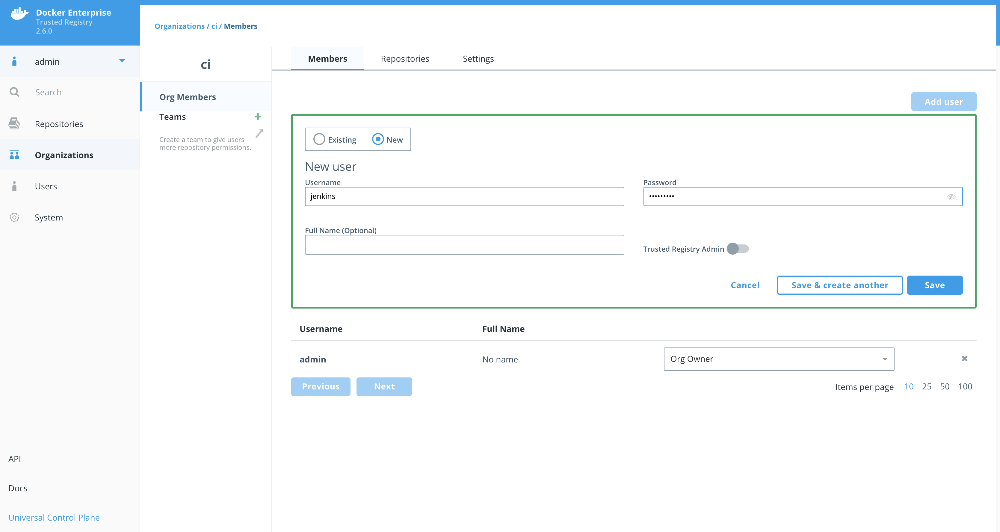
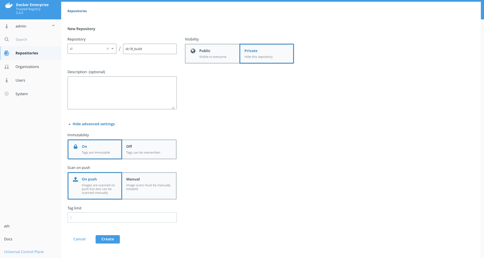

# Secure, Automated Software Supply Chain - Dockercon 2018

In this lab you will integrate Docker Enterpise Edition Advanced in to your development pipeline. You will build your application from a Dockerfile and push your image to the Docker Trusted Registry (DTR). DTR will scan your image for vulnerabilities so they can be fixed before your application is deployed. This helps you build more secure apps!


> **Difficulty**: Intermediate

> **Time**: Approximately 90 minutes

> **Tasks**:
>
> * [Prerequisites](#prerequisites)
> * [Introduction](#introduction)
> * [Task 1: Accessing PWD](#task1)
>   * [Task 1.1: Set Up Environment Variables](#task1.1)
> * [Task 2: Enable Docker Image Scanning](#task2)
> * [Task 3: Create Jenkins User and Organization](#task3)
>   * [Task 3.1: Create Jenkins Organization](#task3.1)
>   * [Task 3.2: Create Jenkins User](#task3.2)
>   * [Task 3.3: Create Jenkins DTR Token](#task3.3)
> * [Task 4: Create DTR Repository](#task4)
>   * [Task 4.1: Create Promotion Policy (Private to Public)](#task4.1)
>   * [Task 4.2: Create Promotion Policy (Private to Hub.docker.com)](#task4.2)
> * [Task 5: Pull / Push Docker Image ](#task5)
>   * [Task 5.1: Pull Image](#task5.1)
>   * [Task 5.2: Tag Image](#task5.2)
>   * [Task 5.3: Push Image](#task5.2)
> * [Task 6: Review Scan Results ](#task6)
>   * [Task 6.1: Manually Promote Image ](#task6.1)
> * [Task 7: Docker Content Trust ](#task7)
> * [Task 8: Automate with Jenkins ](#task8)
> * [Conclusion](#conclusion)

## Document conventions
When you encounter a phrase in between `<` and `>`  you are meant to substitute in a different value.
We are going to leverage the power of [Play With Docker](http://play-with-docker.com).

## <a name="abbreviations"></a>Abbreviations
The following abbreviations are used in this document:

* UCP = Universal Control Plane
* DTR = Docker Trusted Registry
* DCT = Docker Content Trust
* EE = Docker Enterprise Edition
* BOM = Bill of Materials
* CVE = Common Vulnerabilities and Exposures
* PWD = Play With Docker

## <a name="prerequisites"></a>Prerequisites
This lab requires an instance of Docker Enterprise Edition (EE). Docker Enterprise Edition includes Docker Universal Control Plane and Docker Trusted Registry. This lab provides Docker EE.

## Understanding the Play With Docker Interface



This workshop is only available to people in a pre-arranged workshop. That may happen through a [Docker Meetup](https://events.docker.com/chapters/), a conference workshop that is being led by someone who has made these arrangements, or special arrangements between Docker and your company. The workshop leader will provide you with the URL to a workshop environment that includes [Docker Enterprise Edition](https://www.docker.com/enterprise-edition). The environment will be based on [Play with Docker](https://labs.play-with-docker.com/).

If none of these apply to you, contact your local [Docker Meetup Chapter](https://events.docker.com/chapters/) and ask if there are any scheduled workshops. In the meantime, you may be interested in the labs available through the [Play with Docker Classroom](training.play-with-docker.com).

There are three main components to the Play With Docker (PWD) interface.

### 1. Console Access
Play with Docker provides access to the 3 Docker EE hosts in your Cluster. These machines are:

* A Linux-based Docker EE 2.0 (UCP 3.0.1 & 17.06.2-ee11)  Manager node
* Three Linux-based Docker EE 2.0 (17.06.2-ee11) Worker nodes
* A Windows Server 2016-based Docker EE 17.06 Worker Node

By clicking a name on the left, the console window will be connected to that node.

### 2. Access to your Universal Control Plane (UCP) and Docker Trusted Registry (DTR) servers
Additionally, the PWD screen provides you with a one-click access to the Universal Control Plane (UCP)
web-based management interface as well as the Docker Trusted Registry (DTR) web-based management interface. Clicking on either the `UCP` or `DTR` button will bring up the respective server web interface in a new tab.

### 3. Session Information
Throughout the lab you will be asked to provide either hostnames or login credentials that are unique to your environment. These are displayed for you at the bottom of the screen.

**Note:**  There are a limited number of lab connections available for the day. You can use the same session all day by simply keeping your browser connection to the PWD environment open between sessions. This will help us get as many people connected as possible, and prevent you needing to get new credentials and hostnames in every lab. However, if you do lose your connection between sessions simply go to the PWD URL again and you will be given a new session.

## <a name="introduction"></a> Introduction
This workshop is designed to demonstrate the power of Docker Secrets, Image Promotion, Scanning Engine, and Content Trust. We will walk through creating a few secrets. Deploying a stack that uses the secret. Then we will create a Docker Trusted Registry repository where we can create a promotion policy. The promotion policy leverages the output from Image Scanning result. This is the foundation of creating a Secure Supply Chain. You can read more about  secure supply chains for our [Secure Supply Chain reference architecture](https://success.docker.com/article/secure-supply-chain).

## <a name="task 1"></a>Task 1: Accessing PWD
1. Navigate in your web browser to the URL the workshop organizer provided to you.

2. Fill out the form, and click `submit`. You will then be redirected to the PWD environment.

	It may take a minute or so to provision out your PWD environment. 
	
### <a name="task1.1"></a>Task 1.1: Set Up Environment Variables
We are going to use `worker3` for all our command line work. Click on `worker3` to activate the shell. 


Now we need to setup a few variables. But the easiest way is to clone the Workshop Repo.

```
git clone https://github.com/clemenko/dc18_supply_chain.git
```

Once cloned, now we can run the `var_setup.sh` script. 

```
. dc18_supply_chain/var_setup.sh
```
	
Now your PWD environment variables are setup. We will use the variables for some scripting. 


## <a name="task2"></a>Task 2: Enable Docker Image Scanning
Before we create the repositories, let's start with enabling the Docker Image Scanning engine.

1. From the main PWD screen click the `DTR` button on the left side of the screen

	> **Note**: Because this is a lab-based install of Docker EE we are using the default self-signed certs. Because of this your browser may display a security warning. It is safe to click through this warning.
	>
	> In a production environment you would use certs from a trusted certificate authority and would not see this screen.
	>
	> 

2.  Navigate to `System`on the left pane, then `Security`.


3.  Select `Enable Scanning`. In the popup leave it in `Online` mode and select `Enable`. The CVE database will start downloading. This can take a few minutes. Please be patient for it to complete.
    

**You will notice the yellow banner while DTR is downloading the CVE database. It will take some time to download.**

## <a name="task3"></a>Task 3: Create Jenkins User and Organization
In order to setup our automation we need to create an organization and a user account for Jenkins. We are going to create a user named `jenkins` in the organization `ci`. 

### <a name="task3.1"></a>Task 3.1: Create Jenkins Organization
1. From the `PWD` main page click on `DTR`. 



2. Once in `DTR` navigate to `Organizations` on the left. 
3. Now click `New organization`.
4. Type in `ci` and click `Save`.



Now we should see the organization named `ci`. 


### <a name="task3.2"></a>Task 3.2: Create Jenkins User
While remaining in DTR we can create the user from here. 

1. Click on the organization `ci`.
2. Click `Add user`. 
3. Make sure you click the radio button `New`. Add a new user name `jenkins`. Set a simple password that you can remember. Maybe `admin1234`?
 


Now change the permissions for the `jenkins` account to `Org Owner`.


### <a name="task3.3"></a>Task 3.3: Create Jenkins DTR Token
Now that we have the `jenkins` user created we need to add a token for use with DTR's API. 

Navigate to `Users` on the left pane. Click on `jenkins`, then click the `Access Tokens` tab. 


Click `New access token`. Enter `api` into the description field and click `Create`.  

**Write down the token that is displayed. You will need this again!**

It should look like `ee9d7ff2-6fd4-4a41-9971-789e06e0d5d5`. Click `Done`. 

Lets add it to the `worker3` environment. 

```
export DTR_TOKEN=ee9d7ff2-6fd4-4a41-9971-789e06e0d5d5
```

## <a name="task4"></a>Task 4: Create DTR Repository
We now need to access Docker Trusted Registry to setup two repositories.

We have an easy way with a script or the hard way by using the GUI. 

Either way we need to create two repositories, `dc18_build` and `dc18`. `dc18_build` will be used for the private version of the image. `dc18` will be the public version once an CVE scan is complete. 

**Easy Way:**

Since we `git cloned` the repo for this workshop we can use a script that will create the repo. 

```
./dc18_supply_chain/create_repos.sh
```

Feel free to `cat` the file to see how we are using `curl` and the API to create the repositories. 

```
cat ./dc18_supply_chain/create_repos.sh
#!/bin/bash
# requires environment variables: DTR_HOST, DTR_USERNAME and DTR_TOKEN

curl -X POST -k -L \
  -u $DTR_USERNAME:$DTR_TOKEN \
  https://$DTR_URL/api/v0/repositories/ci \
  -H 'Content-Type: application/json' \
  -d '{
  "enableManifestLists": true,
  "immutableTags": true,
  "longDescription": "",
  "name": "dc18",
  "scanOnPush": true,
  "shortDescription": "Dockercon 2018 Example - public",
  "visibility": "public"
}'

curl -X POST -k -L \
  -u $DTR_USERNAME:$DTR_TOKEN \
  https://$DTR_URL/api/v0/repositories/ci \
  -H 'Content-Type: application/json' \
  -d '{
  "enableManifestLists": true,
  "immutableTags": true,
  "longDescription": "",
  "name": "dc18_build",
  "scanOnPush": true,
  "shortDescription": "Dockercon 2018 Example - private",
  "visibility": "public"
}'
```

**Hard Way:**

1. Navigate to `Repositories` on the left menu and click `New repository`.
2. Create that looks like `ci`/`dc18_build`. Make sure you click `Private`. Do not click `Create` yet!
3. Click `Show advanced settings` and then click `On Push` under `SCAN ON PUSH`.  This will ensure that the CVE scan will start right after every push to this repository.  And turn on `IMMUTABILITY `. Then click `Create`.


4. Now let's create the second repository in a similar fashion. Create a `Public` repository as `admin`/`alpine` with `SCAN ON PUSH` set to `On Push`.

5. Repeat this for creating the `ci`/`dc18` `Public` repository with `SCAN ON PUSH` set to `On Push`.
6. We should have two repositories now.
    

### <a name="task4.1"></a>Task 4.1: Create Promotion Policy

### <a name="task4.2"></a>Task 4.2: Create Promotion Policy

### <a name="task4.3"></a>Task 4.3: Create Promotion Policy
With the two repositories setup we can now define the promotion policy. We need to create a target policy that has a `CRITERIA` of `Critical Vulnerabilities` equal to zero. The policy will target the `admin`/`alpine` repository.

1. Navigate to the `admin`/`alpine_build` repository. Click `Promotions` and click `New promotion policy`.
2. In the `PROMOTE TO TARGET IF...` box select `Critical Vulnerabilities` and then check `equals`. In the box below `equals` enter the number zero (0) and click `Add`.
3. Set the `TARGET REPOSITORY` to `admin`/`alpine` and click `Save & Apply`.
  

 Perfect. Now let's push am image that will be scanned and promoted.

## <a name="task5"></a>Task 5: Pull / Push Docker Image
In order to push and pull images to DTR we will need to take advantage of PWD's Console Access.

1. Navigate back to the PWD tab in your browser.
2. Click on `worker1`. Honestly, it doesn't matter which worker we use. We just need a docker daemon.
3. In the console we need to create a variable called `URL` from the `DTR Hostname`. This will greatly reduce the amount of typing. Locate the url.

     

  In the console type :
  >**Note:** Change the `URL` to what is listed for your DTR Hostname.

  ```
  URL=ip172-18-0-6-bb1tkep2a5gg0083vd7g.direct.beta-hybrid.play-with-docker.com
  ```

4. Now we can start pulling img.

  ```
  docker pull alpine
  ```
  This command is pulling the `alpine` image from [hub.docker.com](https://hub.docker.com).

  ```
  [worker1] (local) root@10.20.0.23 ~
  $ docker pull alpine
  Using default tag: latest
  latest: Pulling from library/alpine
  Digest: sha256:7df6db5aa61ae9480f52f0b3a06a140ab98d427f86d8d5de0bedab9b8df6b1c0
  Status: Image is up to date for alpine:latest
 ```

5. Now let's tag the image for our DTR instance. We will use the `URL` variable we set before.
   The tag command looks like `docker image tag <FROM> <TO>`.

   ```
   docker image tag alpine $URL/admin/alpine_build
   ```


6. Now let's `docker login` into our DTR instance with the `admin` credentials.

  ```
  docker login -u admin $URL
  ```
7. Now we can `docker push` the image to DTR.

  ```
  docker push $URL/admin/alpine_build
  ```

8. With the completed `docker push` we can now navigate back to the DTR's gui. From the gui we can check on the image scan. Navigate to `Repositories` --> `admin/alpine_build`--> `IMAGES`. You should see a similar image tagged `latest`.
 >**Note:** Did your image scan clean?

  

8. Now let's check the `admin/alpine` images. Navigate to `Repositories` --> `admin/alpine`--> `IMAGES`.
 >**Note:** Do you see the `PROMOTED` badge?

  

## <a name="task6"></a>Task 6: Bad Docker Image
Let's take a look at pushing an older image that we know will have some vulnerabilities.

1. Docker pull :

   ```
   docker pull alpine:3.1
   ```


2. Tag and push to DTR.

    ```
    docker tag alpine:3.1 $URL/admin/alpine_build:3.1
    ```

    and

    ```
    docker push $URL/admin/alpine_build:3.1
    ```


3. Navigate to DTR --> `Repostories` --> `admin/alpine` --> `Images`.
    

4. Take a look at the details to see exactly what piece of the image is vulnerable.
    


## <a name="task7"></a>Task 7: Docker Content Trust
Docker Content Trust/Notary is a tool for publishing and managing trusted collections of content. Publishers can digitally sign collections and consumers can verify integrity and origin of content. This ability is built on a straightforward key management and signing interface to create signed collections and configure trusted publishers.

Docker Content Trust/Notary provides a cryptographic signature for each image. The signature provides security so that the image requested is the image you get. Read [Notary's Architecture](https://docs.docker.com/notary/service_architecture/) to learn more about how Notary is secure. Since Docker EE is "Secure by Default," Docker Trusted Registry comes with the Notary server out of the box.

In addition, Docker Content Trust allows for threshold signing and gating for the releases. Under this model, software is not released until all necessary parties (or a quorum) sign off. This can be enforced by requiring (and verifying) the needed signatures for an image. This policy ensures that the image has made it through the whole process: if someone tries to make it skip a step, the image will lack a necessary signature, thus preventing deployment of that image.

The following examples shows the basic usage of Notary. To use image signing, create a repository in DTR and enable it on the local Docker engine. First, enable the client, and sign an image. Let's use the `admin/alpine` image.

1. Pull the image locally.

   ```
   docker pull $URL/admin/alpine
   ```

2. Enable Docker Content Trust on the client side.

   ```
   export DOCKER_CONTENT_TRUST=1
   ```

3. Push the alpine image back.
 >**Note:** For Docker Content Trust you need to push/pull with the tag. Defaulting to latest doesn't work.

   ```
   docker push $URL/admin/alpine:latest
   ```

   Pushing with `DOCKER_CONTENT_TRUST=1` will check If the necessary keys are setup. If not, the docker client will ask you to generate them. As you can see in the example below you will need to create a `root` key password and a `repository` key password. Feel free to enter any password. Here is an example:

  

4. Review the repository on DTR now.

  


## <a name="Conclusion"></a>Conclusion
In this lab we been able to leverage the power of Docker Enterprise Edition for creating and using secrets. We also were able to create the foundation of a secure supply chain with Docker Image Scanning and Docker Content Trust.
